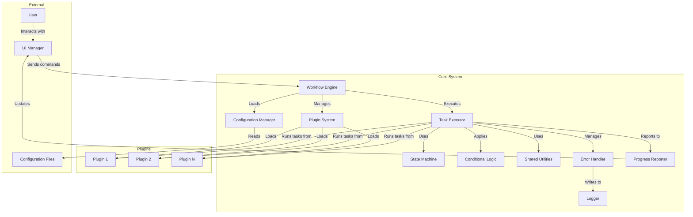

# TAO Agent v2.0 Architectural Diagram

## Overview

This document presents the architectural diagram for the Task Automation Orchestrator (TAO) Agent v2.0. The diagram illustrates the key components of the system, their interactions, and the flow of data and control.

## Diagrams

```
+----------------+     +------------------------------------------------------+
|    External    |     |                     Core System                       |
|  +----------+  |     |  +---------------+        +----------------+          |
|  |   User   |  |     |  |               |        |                |          |
|  +----+-----+  |     |  |    Workflow   |        |  Configuration |          |
|       |        |     |  |    Engine     |<-------|    Manager     |          |
|       v        |     |  |               |        |                |          |
|  +----------+  |     |  +---+---+---+---+        +----------------+          |
|  |    UI    |  |     |      |   |   |                    ^                   |
|  | Manager  |--+-----+----->|   |   |                    |                   |
|  +----------+  |     |      |   |   |            +-------+--------+          |
|       ^        |     |      |   |   |            |                |          |
|       |        |     |      |   |   |            | Configuration  |          |
+-------+--------+     |      |   |   |            |     Files      |          |
        |              |      |   |   |            |                |          |
        |              |      v   v   v            +----------------+          |
        |              |  +---------------+                                    |
        |              |  |               |        +----------------+          |
        |              |  | Task Executor |<-------|  Plugin System |          |
        |              |  |               |        |                |          |
        |              |  +---+---+---+---+        +--------+-------+          |
        |              |      |   |   |   |                 |                  |
        |              |      |   |   |   |                 v                  |
        |              |      |   |   |   |        +----------------+          |
        |              |      |   |   |   |        |     Plugins    |          |
        |              |      |   |   |   |        |  +----------+  |          |
        |              |      |   |   |   |        |  | Plugin 1 |  |          |
        |              |      |   |   |   |        |  +----------+  |          |
        |              |      |   |   |   |        |  | Plugin 2 |  |          |
        |              |      |   |   |   |        |  +----------+  |          |
        |              |      |   |   |   |        |  | Plugin N |  |          |
        |              |      |   |   |   |        |  +----------+  |          |
        |              |      |   |   |   |        +----------------+          |
        |              |      |   |   |   |                                    |
        |              |      v   v   v   v                                    |
        |              |  +-------+ +------------+ +-----------------+         |
        |              |  | State | |Conditional | | Shared Utilities|         |
        |              |  |Machine| |   Logic    | |                 |         |
        |              |  +-------+ +------------+ +-----------------+         |
        |              |                                                       |
        |              |  +------------+  +--------+  +------------------+     |
        |              |  |   Error    |  |        |  |    Progress      |     |
        |              |  |  Handler   |->| Logger |  |    Reporter      |     |
        |              |  +------------+  +--------+  +--------+---------+     |
        |              |                                       |               |
        +--------------+---------------------------------------+               |
                       +------------------------------------------------------+
```



## Component Descriptions

1. **UI Manager**: Handles user interactions through CLI or GUI interfaces.
2. **Workflow Engine**: The central component that orchestrates the entire process flow.
3. **Configuration Manager**: Loads and parses YAML configuration files.
4. **Plugin System**: Manages the loading and integration of custom plugins.
5. **Task Executor**: Responsible for executing individual tasks and managing their lifecycle.
6. **State Machine**: Maintains and manages the state of the workflow execution.
7. **Conditional Logic Module**: Implements rule-based decision making for dynamic workflow control.
8. **Shared Utilities**: A library of common functions available to all tasks and plugins.
9. **Error Handler**: Manages error detection, reporting, and recovery strategies.
10. **Logger**: Records system events, task executions, and error information.
11. **Progress Reporter**: Tracks and reports the progress of tasks and overall workflow.

## Key Architectural Features

1. **Modular Design**: The system is composed of loosely coupled components, allowing for easy maintenance and extension.
2. **Plugin-Based Architecture**: Custom functionality can be added through plugins without modifying the core system.
3. **Separation of Concerns**: Task logic is separated from the core system, residing in plugins.
4. **Centralized Workflow Management**: The Workflow Engine coordinates all aspects of task execution and flow control.
5. **Flexible Configuration**: The Configuration Manager allows for dynamic system behavior through YAML files.
6. **Robust Error Handling**: The Error Handler works in conjunction with the Logger to manage and record issues at multiple levels.
7. **State-Based Execution**: The State Machine ensures that the system can manage complex, stateful workflows.
8. **Dynamic Decision Making**: The Conditional Logic Module allows for adaptive workflow execution based on configurable rules.

## Data and Control Flow

1. The user interacts with the system through the UI Manager.
2. The Workflow Engine receives commands and coordinates the overall process.
3. Configuration data is loaded from YAML files through the Configuration Manager.
4. The Plugin System loads custom plugins as specified in the configuration.
5. The Task Executor runs tasks from the loaded plugins, using the State Machine to track progress.
6. The Conditional Logic Module is applied to make dynamic decisions during task execution.
7. Shared Utilities provide common functionality across tasks and plugins.
8. Errors are managed by the Error Handler and recorded by the Logger.
9. The Progress Reporter keeps the UI updated on the workflow status.

## File Layout

taov2/
│
├── config/
│   ├── config.yaml
│   └── state_sol_laws.json
│
├── data/
│   ├── input/
│   ├── output/
│   ├── temp/
│   └── archive/
│
├── logs/
│   └── tao_agent.log
│
├── plugins/
│   ├── __init__.py
│   └── statute_of_limitations.py
│
│
├── src/
│   └── tao/
│       ├── __init__.py
│       ├── main.py
│       ├── workflow_engine.py
│       ├── configuration_manager.py
│       ├── plugin_system.py
│       ├── task_executor.py
│       ├── ui_manager.py
│       ├── state_machine.py
│       ├── error_handler.py
│       ├── progress_reporter.py
│       ├── conditional_logic.py
│       └── shared_utilities.py
│
├── .gitignore
├── LICENSE
├── README.md
└── requirements.txt