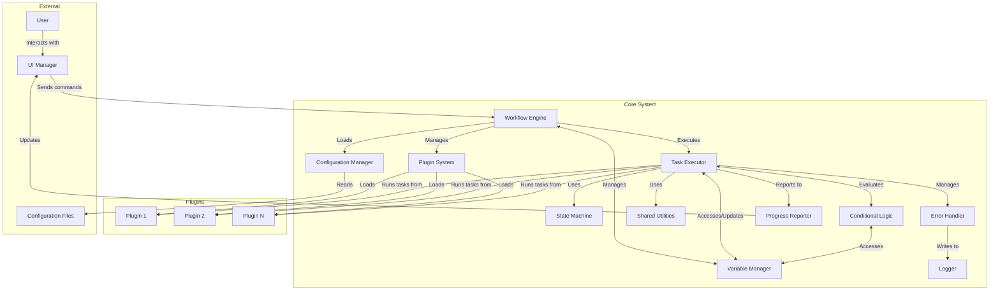

# TAO Agent v2.0 Revised Architectural Diagram

## Overview

This document presents the revised architectural diagram for the Task Automation Orchestrator (TAO) Agent v2.0, incorporating enhanced variable management and conditional logic capabilities. The diagram illustrates the key components of the system, their interactions, and the flow of data and control.

## Diagrams

```
+----------------+     +------------------------------------------------------+
|    External    |     |                     Core System                       |
|  +----------+  |     |  +---------------+        +----------------+          |
|  |   User   |  |     |  |               |        |                |          |
|  +----+-----+  |     |  |    Workflow   |        |  Configuration |          |
|       |        |     |  |    Engine     |<-------|    Manager     |          |
|       v        |     |  |               |        |                |          |
|  +----------+  |     |  +---+---+---+---+        +--------+-------+          |
|  |    UI    |  |     |      |   |   |                    ^                   |
|  | Manager  |--+-----+----->|   |   |                    |                   |
|  +----------+  |     |      |   |   |            +-------+--------+          |
|       ^        |     |      |   |   |            |                |          |
|       |        |     |      |   |   |            | Configuration  |          |
+-------+--------+     |      |   |   |            |     Files      |          |
        |              |      |   |   |            |                |          |
        |              |      v   v   v            +----------------+          |
        |              |  +---------------+        +----------------+          |
        |              |  |               |        |    Variable    |          |
        |              |  | Task Executor |<------>|    Manager     |          |
        |              |  |               |        |                |          |
        |              |  +---+---+---+---+        +----------------+          |
        |              |      |   |   |   |                ^                   |
        |              |      |   |   |   |                |                   |
        |              |      |   |   |   |        +-------+--------+          |
        |              |      |   |   |   |        |  Plugin System |          |
        |              |      |   |   |   |        |                |          |
        |              |      |   |   |   |        +--------+-------+          |
        |              |      |   |   |   |                 |                  |
        |              |      |   |   |   |                 v                  |
        |              |      |   |   |   |        +----------------+          |
        |              |      |   |   |   |        |     Plugins    |          |
        |              |      |   |   |   |        |  +----------+  |          |
        |              |      |   |   |   |        |  | Plugin 1 |  |          |
        |              |      |   |   |   |        |  +----------+  |          |
        |              |      |   |   |   |        |  | Plugin 2 |  |          |
        |              |      |   |   |   |        |  +----------+  |          |
        |              |      |   |   |   |        |  | Plugin N |  |          |
        |              |      |   |   |   |        |  +----------+  |          |
        |              |      |   |   |   |        +----------------+          |
        |              |      |   |   |   |                                    |
        |              |      v   v   v   v                                    |
        |              |  +-------+ +------------+ +-----------------+         |
        |              |  | State | |Conditional | | Shared Utilities|         |
        |              |  |Machine| |   Logic    | |                 |         |
        |              |  +-------+ +------------+ +-----------------+         |
        |              |      ^            ^                ^                  |
        |              |      |            |                |                  |
        |              |  +---+------------+----------------+---+              |
        |              |  |   Error Handler and Logger          |              |
        |              |  +----------------------------------------+            |
        |              |                     |                                 |
        |              |                     v                                 |
        |              |            +------------------+                       |
        |              |            |    Progress      |                       |
        |              |            |    Reporter      |                       |
        |              |            +--------+---------+                       |
        |              |                     |                                 |
        +--------------+---------------------+---------------------------------+
                       +------------------------------------------------------+
```



## Component Descriptions

1. **UI Manager**: Handles user interactions through CLI or GUI interfaces.
2. **Workflow Engine**: The central component that orchestrates the entire process flow, now with enhanced support for dynamic variables and conditional logic.
3. **Configuration Manager**: Loads and parses YAML configuration files, including new structures for variable definitions and enhanced conditional logic.
4. **Variable Manager**: New component that manages the lifecycle of variables, including definition, resolution, and updates throughout the workflow execution.
5. **Plugin System**: Manages the loading and integration of custom plugins, now with support for accessing and modifying variables.
6. **Task Executor**: Responsible for executing individual tasks and managing their lifecycle, with added capabilities for variable resolution and dynamic branching based on conditional logic.
7. **State Machine**: Maintains and manages the state of the workflow execution, now including variable states.
8. **Conditional Logic Module**: Implements rule-based decision making for dynamic workflow control, with enhanced capabilities for complex conditions using variables and task outputs.
9. **Shared Utilities**: A library of common functions available to all tasks and plugins, expanded to include variable-related operations.
10. **Error Handler**: Manages error detection, reporting, and recovery strategies, now with context-aware error handling using workflow variables.
11. **Logger**: Records system events, task executions, and error information, with added support for logging variable states and conditional logic decisions.
12. **Progress Reporter**: Tracks and reports the progress of tasks and overall workflow, now including information about variable states and conditional branches taken.

## Key Architectural Features

1. **Dynamic Variable Management**: Variables can be defined, modified, and accessed throughout the workflow, enabling more flexible and adaptable task execution.
2. **Enhanced Conditional Logic**: Complex decision trees can be created using runtime variables, task outputs, and nested conditions.
3. **Modular Design**: The system remains composed of loosely coupled components, now with added flexibility through dynamic variables.
4. **Plugin-Based Architecture**: Custom functionality can be added through plugins, which can now interact with the Variable Manager for more complex operations.
5. **Separation of Concerns**: Task logic remains separated from the core system, with plugins now able to leverage enhanced variable and conditional capabilities.
6. **Centralized Workflow Management**: The Workflow Engine coordinates all aspects of task execution, flow control, and variable management.
7. **Flexible Configuration**: The Configuration Manager allows for even more dynamic system behavior through expanded YAML files that include variable definitions and complex conditional logic.
8. **Robust Error Handling**: The Error Handler works in conjunction with the Logger to manage and record issues, now with added context from workflow variables.
9. **State-Based Execution**: The State Machine ensures that the system can manage complex, stateful workflows, including the state of variables throughout execution.
10. **Dynamic Decision Making**: The enhanced Conditional Logic Module allows for highly adaptive workflow execution based on configurable rules and runtime variable values.

## Data and Control Flow

1. The user interacts with the system through the UI Manager.
2. The Workflow Engine receives commands and coordinates the overall process.
3. Configuration data, including variable definitions and conditional logic rules, is loaded from YAML files through the Configuration Manager.
4. The Variable Manager initializes variables based on the configuration.
5. The Plugin System loads custom plugins as specified in the configuration.
6. The Task Executor runs tasks from the loaded plugins, interacting with the Variable Manager to resolve and update variables.
7. Before each task execution, the Conditional Logic Module evaluates conditions based on current variable states and previous task outputs.
8. The State Machine tracks progress, including the current state of all variables.
9. Shared Utilities provide common functionality across tasks and plugins, including variable-related operations.
10. Errors are managed by the Error Handler, logged with variable context, and recorded by the Logger.
11. The Progress Reporter keeps the UI updated on the workflow status, including information about variable states and conditional branches taken.


## File Layout

taov2/
│
├── config/
│   ├── config.yaml
│   └── state_sol_laws.json
│
├── data/
│   ├── input/
│   ├── output/
│   ├── temp/
│   └── archive/
│
├── logs/
│   └── tao_agent.log
│
├── plugins/
│   ├── __init__.py
│   └── base_plugin.py
│
│
├── src/
│   └── tao/
│       ├── __init__.py
│       ├── main.py
│       ├── workflow_engine.py
│       ├── configuration_manager.py
│       ├── plugin_system.py
│       ├── base_plugin.py
│       ├── task_executor.py
│       ├── ui_manager.py
│       ├── state_machine.py
│       ├── error_handler.py
│       ├── progress_reporter.py
│       ├── conditional_logic.py
│       └── shared_utilities.py
│
├── .gitignore
├── LICENSE
├── README.md
└── requirements.txt