# TAO Agent v2.0 Call Graph

## Overview

This document presents the Call Graph for the Task Automation Orchestrator (TAO) Agent v2.0. The graph illustrates the relationships and function calls between different modules and components in the redesigned system.

## Call Graph

```mermaid
graph TD
    Main[main.py] --> UI[UI_Manager.run]
    UI --> WE[WorkflowEngine.execute_workflow]
    
    WE --> CM[ConfigurationManager.load_config]
    WE --> PS[PluginSystem.load_plugins]
    WE --> TE[TaskExecutor.execute_task]
    
    TE --> SM[StateMachine.get_state]
    TE --> SM[StateMachine.update_state]
    TE --> CL[ConditionalLogic.evaluate]
    TE --> SU[SharedUtilities.perform_operation]
    TE --> EH[ErrorHandler.handle_error]
    TE --> PR[ProgressReporter.update_progress]
    
    EH --> L[Logger.log_error]
    
    subgraph "Plugin: StatuteOfLimitations"
        TE --> SOL_DS[determine_processing_scope]
        TE --> SOL_CW[clean_workspace]
        TE --> SOL_RF[retrieve_new_input_files]
        TE --> SOL_CF[consolidate_input_files]
        TE --> SOL_CS[calculate_statute_of_limitations]
        TE --> SOL_GI[generate_input_files]
        TE --> SOL_PI[process_input_files]
        TE --> SOL_CL[copy_to_lcs_data]
        TE --> SOL_UH[update_processing_history]
    end
    
    CM --> YAMLParser[yaml.safe_load]
    PS --> importlib[importlib.import_module]
    
    SOL_DS --> SU
    SOL_CW --> SU
    SOL_RF --> SU
    SOL_CF --> SU
    SOL_CS --> SU
    SOL_GI --> SU
    SOL_PI --> SU
    SOL_CL --> SU
    SOL_UH --> SU
    
    classDef core fill:#f9f,stroke:#333,stroke-width:2px;
    classDef plugin fill:#bbf,stroke:#333,stroke-width:2px;
    classDef external fill:#bfb,stroke:#333,stroke-width:2px;
    
    class Main,UI,WE,CM,PS,TE,SM,CL,SU,EH,PR,L core;
    class SOL_DS,SOL_CW,SOL_RF,SOL_CF,SOL_CS,SOL_GI,SOL_PI,SOL_CL,SOL_UH plugin;
    class YAMLParser,importlib external;
```

## Module Descriptions

1. **main.py**: Entry point of the application.
2. **UI_Manager**: Handles user interactions and displays results.
3. **WorkflowEngine**: Orchestrates the overall workflow execution.
4. **ConfigurationManager**: Loads and parses configuration files.
5. **PluginSystem**: Manages loading and integration of plugins.
6. **TaskExecutor**: Executes individual tasks in the workflow.
7. **StateMachine**: Manages and updates the state of the workflow.
8. **ConditionalLogic**: Evaluates conditions for task execution.
9. **SharedUtilities**: Provides common utility functions.
10. **ErrorHandler**: Manages error detection and handling.
11. **Logger**: Records system events and errors.
12. **ProgressReporter**: Updates and reports task progress.

## Plugin: StatuteOfLimitations

This plugin implements specific tasks for the Statute of Limitations workflow:

1. **determine_processing_scope**: Determines the date range for processing.
2. **clean_workspace**: Prepares the workspace for new data processing.
3. **retrieve_new_input_files**: Retrieves new input files for processing.
4. **consolidate_input_files**: Combines all input files into a single file.
5. **calculate_statute_of_limitations**: Calculates SoL dates for each record.
6. **generate_input_files**: Generates system-specific input files.
7. **process_input_files**: Processes the generated input files.
8. **copy_to_lcs_data**: Copies processed files to the LCS data directory.
9. **update_processing_history**: Updates the processing history database.

## Key Relationships

1. The `WorkflowEngine` is the central coordinator, calling methods from `ConfigurationManager`, `PluginSystem`, and `TaskExecutor`.
2. `TaskExecutor` interacts with various core components (`StateMachine`, `ConditionalLogic`, `SharedUtilities`, `ErrorHandler`, `ProgressReporter`) to execute tasks.
3. Plugin tasks (e.g., from StatuteOfLimitations) are called by the `TaskExecutor` and can use `SharedUtilities` for common operations.
4. Error handling is centralized through the `ErrorHandler`, which uses the `Logger` to record errors.

## Notes

- Core system components are shown in pink.
- Plugin-specific functions are shown in light blue.
- External library calls (e.g., YAML parsing, module importing) are shown in light green.
- This call graph represents the high-level structure and main function calls. Detailed error handling paths and some utility function calls may be omitted for clarity.

This Call Graph provides a comprehensive overview of the function calls and relationships between different modules in TAO Agent v2.0, reflecting the plugin-based architecture and the separation of core system logic from specific task implementations.