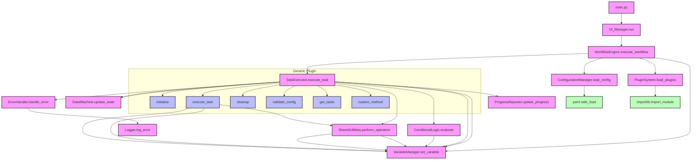

# TAO Agent v2.0 Call Graph with Generic Plugin Structure

## Overview

This document presents the Call Graph for the Task Automation Orchestrator (TAO) Agent v2.0, incorporating enhanced variable management, conditional logic capabilities, and a generic plugin structure. The graph illustrates the relationships and function calls between different modules and components in the redesigned system, emphasizing flexibility and adaptability for various automation tasks.

## Call Graph
```
                    +----------+
                    |  main.py |
                    +----+-----+
                         |
                         v
                +--------+--------+
                |   UI_Manager    |
                +--------+--------+
                         |
                         v
            +------------+--------------+
            |     WorkflowEngine        |
            +------------+--------------+
                |    |    |    |    |
        +-------+    |    |    |    +------+
        |            |    |    |           |
        v            v    v    v           v
  +----------+  +----+--+ +--+---+  +------+-----+
  | Config   |  |Variable| |Plugin|  | Error     |
  | Manager  |  |Manager| |System|  | Handler   |
  +-----+----+  +----+--+ +--+---+  +------+-----+
        |            |       |             |
        |      +-----+       |             |
        |      |             |             |
        v      v             v             v
  +-----+------+--+  +-------+-----+  +----+----+
  | TaskExecutor   |  | Conditional |  | Logger |
  +-----+------+--+  | Logic       |  +---------+
        |      |     +-------+-----+
        |      |             ^
        |      |             |
        |      |     +-------+-----+
        |      +---->| State       |
        |            | Machine     |
        |            +-------------+
        |
        |     +----------------+
        +---->| Shared         |
        |     | Utilities      |
        |     +----------------+
        |
        |     +----------------+
        +---->| Progress       |
              | Reporter       |
              +----------------+

    +----------------------------------------+
    |        Generic Plugin Structure        |
    | +----------+  +----------+  +--------+ |
    | |initialize|  |execute_  |  |cleanup | |
    | |          |  |task      |  |        | |
    | +----------+  +----------+  +--------+ |
    |                                        |
    | +----------+  +----------+  +--------+ |
    | |validate_ |  |get_      |  |custom_ | |
    | |config    |  |tasks     |  |method  | |
    | +----------+  +----------+  +--------+ |
    +----------------------------------------+
```



## Module Descriptions

1. **main.py**: Entry point of the application.
2. **UI_Manager**: Handles user interactions and displays results.
3. **WorkflowEngine**: Orchestrates the overall workflow execution, including variable initialization and plugin management.
4. **ConfigurationManager**: Loads and parses configuration files, including variable definitions and conditional logic rules.
5. **VariableManager**: Manages variable lifecycle, including initialization, access, and updates.
6. **PluginSystem**: Manages loading and integration of generic plugins.
7. **TaskExecutor**: Executes individual tasks in the workflow, interacting with plugins and managing variables.
8. **StateMachine**: Manages and updates the state of the workflow, potentially including variable states.
9. **ConditionalLogic**: Evaluates conditions for task execution, with access to variables for complex conditions.
10. **SharedUtilities**: Provides common utility functions, with ability to access and modify variables.
11. **ErrorHandler**: Manages error detection and handling, with potential access to variable context.
12. **Logger**: Records system events, errors, and potentially variable states.
13. **ProgressReporter**: Updates and reports task progress, potentially including variable state information.

## Generic Plugin Structure

The generic plugin structure includes the following methods:

1. **initialize**: Sets up the plugin when it's first loaded.
2. **execute_task**: Performs the main functionality of the plugin for a given task.
3. **cleanup**: Performs any necessary cleanup operations when the plugin is unloaded.
4. **validate_config**: Validates the plugin's configuration.
5. **get_tasks**: Returns a list of tasks that the plugin can perform.
6. **custom_method**: Represents any additional custom methods that a plugin might implement.

## Key Relationships

1. The `WorkflowEngine` remains the central coordinator, managing the `VariableManager` and `PluginSystem`.
2. `ConfigurationManager` loads variable definitions, conditional logic rules, and plugin configurations.
3. `PluginSystem` loads and manages generic plugins based on the configuration.
4. `TaskExecutor` interacts with loaded plugins to execute tasks, managing variables through `VariableManager`.
5. Generic plugins can access and modify variables through `VariableManager`, and use `SharedUtilities` for common operations.
6. `ConditionalLogic` accesses variables through `VariableManager` for evaluating complex conditions defined in the configuration.
7. Error handling through `ErrorHandler` may include variable and plugin context in logged errors.

## Notes

- Core system components are shown in pink.
- Generic plugin methods are shown in light blue.
- External library calls (e.g., YAML parsing, module importing) are shown in light green.
- The `VariableManager` component is central to enabling dynamic behavior across the system and plugins.
- This generic structure allows for easy addition of new plugins without modifying the core system.
- Conditional logic and variable management are now applicable across all plugins, enhancing system flexibility.

This revised call graph represents a more flexible and adaptable TAO Agent v2.0 system, capable of handling a wide range of automation tasks through its generic plugin structure and enhanced variable and conditional logic capabilities.