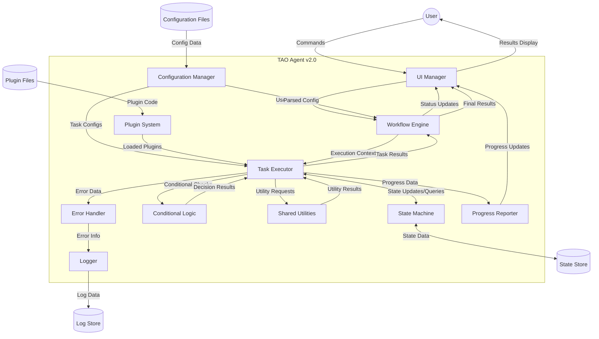

# TAO Agent v2.0 Data Flow Diagram

## Overview

This document presents the Data Flow Diagram (DFD) for the Task Automation Orchestrator (TAO) Agent v2.0. The diagram illustrates how data moves through the system, highlighting the interactions between different components, configuration files, and external entities.

## Diagram
```
    +--------+                  +--------------+
    |  User  |<---------------->|  UI Manager  |
    +--------+                  +------+-------+
                                       ^
                                       |
  +-----------------+           +------+-------+
  |Configuration    |---------->|  Workflow    |
  |Files            |           |  Engine      |
  +-----------------+           +------+-------+
                                       |
  +-----------------+           +------v-------+
  |Plugin           |---------->|  Plugin      |
  |Files            |           |  System      |
  +-----------------+           +------+-------+
                                       |
                                +------v-------+
                                |  Task        |
                                |  Executor    |
                                +---+--+--+--+-+
                                    |  |  |  |
            +------------------------+  |  |  |
            |   +-----------------------+  |  |
            |   |   +----------------------+  |
            |   |   |   +---------------------+
            |   |   |   |
      +-----v---v-+ | +-v----------+ +-----------------+
      |State      | | |Conditional | |Shared           |
      |Machine    | | |Logic       | |Utilities        |
      +-----+-----+ | +-----------++ +-----------------+
            |       |             |
    +-------v-----+ |        +----v-----+   +---------+
    |State Store  | |        |Error     |-->| Logger  |
    +-------------+ |        |Handler   |   +----+----+
                    |        +-----------+        |
                    |                             |
                    |        +-----------+   +----v----+
                    +------->|Progress   |   |Log      |
                             |Reporter   |   |Store    |
                             +-----+-----+   +---------+
                                   |
                                   |
                             +-----v-----+
                             |UI Manager |
                             +-----------+
```




## Data Flow Description

1. **User Interaction**
   - User sends commands through the UI Manager.
   - UI Manager passes user input to the Workflow Engine.
   - Workflow Engine sends status updates back to the UI Manager for display to the user.

2. **Configuration Loading**
   - Configuration Manager reads data from Configuration Files.
   - Parsed configuration is sent to the Workflow Engine and Task Executor.

3. **Plugin Management**
   - Plugin System loads plugin code from Plugin Files.
   - Loaded plugins are made available to the Task Executor.

4. **Workflow Execution**
   - Workflow Engine provides execution context to the Task Executor.
   - Task Executor returns task results to the Workflow Engine.

5. **State Management**
   - Task Executor interacts with the State Machine for state updates and queries.
   - State Machine persists and retrieves state data from the State Store.

6. **Conditional Logic**
   - Task Executor sends conditional checks to the Conditional Logic module.
   - Conditional Logic returns decision results to guide task execution.

7. **Utility Functions**
   - Task Executor requests utility functions from Shared Utilities.
   - Shared Utilities return utility results to the Task Executor.

8. **Error Handling and Logging**
   - Task Executor sends error data to the Error Handler.
   - Error Handler passes error information to the Logger.
   - Logger writes log data to the Log Store.

9. **Progress Reporting**
   - Task Executor sends progress data to the Progress Reporter.
   - Progress Reporter sends updates to the UI Manager for display.

10. **Result Presentation**
    - Workflow Engine sends final results to the UI Manager.
    - UI Manager displays results to the User.

## Key Data Flows

1. **Configuration Data**: Flows from Configuration Files through the Configuration Manager to guide system behavior.
2. **Plugin Data**: Moves from Plugin Files through the Plugin System to extend system functionality.
3. **Task Execution Data**: Flows between the Workflow Engine, Task Executor, and various supporting modules (State Machine, Conditional Logic, etc.).
4. **State Data**: Maintained by the State Machine and persisted in the State Store.
5. **Error and Log Data**: Generated by various components, processed by the Error Handler, and stored by the Logger.
6. **User Interface Data**: Flows between the User, UI Manager, and core system components for command input and result display.

This Data Flow Diagram illustrates the complex interactions within TAO Agent v2.0, highlighting how data moves between components to achieve flexible, configurable task automation.