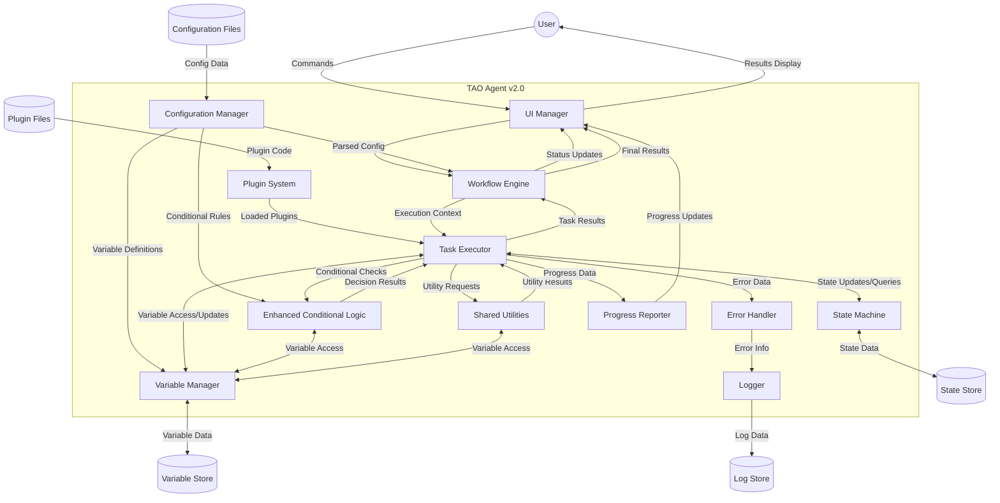

# TAO Agent v2.0 Revised Data Flow Diagram

## Overview

This document presents the revised Data Flow Diagram (DFD) for the Task Automation Orchestrator (TAO) Agent v2.0, incorporating enhanced variable management and conditional logic capabilities. The diagram illustrates how data, including variables and conditional logic rules, moves through the system, highlighting the interactions between different components, configuration files, and external entities.

## Diagram
```
    +--------+                  +--------------+
    |  User  |<---------------->|  UI Manager  |
    +--------+                  +------+-------+
                                       ^
                                       |
  +-----------------+           +------+-------+
  |Configuration    |---------->|  Configuration|
  |Files            |           |  Manager      |
  +-----------------+           +------+-------+
                                       |
                                       v
  +-----------------+           +------+-------+
  |Plugin           |---------->|  Workflow    |
  |Files            |           |  Engine      |
  +-----------------+           +------+-------+
                                       |
                                       v
                                +------+-------+
                                |  Variable    |
                                |  Manager     |
                                +------+-------+
                                       ^
                                       |
                                +------v-------+
                                |  Plugin      |
                                |  System      |
                                +------+-------+
                                       |
                                +------v-------+
                                |  Task        |
                                |  Executor    |
                                +---+--+--+--+-+
                                    |  |  |  |
            +------------------------+  |  |  |
            |   +-----------------------+  |  |
            |   |   +----------------------+  |
            |   |   |   +---------------------+
            |   |   |   |
      +-----v---v-+ | +-v----------+ +-----------------+
      |State      | | |Enhanced    | |Shared           |
      |Machine    | | |Conditional | |Utilities        |
      +-----+-----+ | |Logic       | +-----------------+
            |       | +-----------+           ^
    +-------v-----+ |        ^                |
    |State Store  | |        |                |
    +-------------+ |        |                |
                    |        |                |
  +-----------------+        |                |
  |Variable Store   |<-------+----------------+
  +-----------------+        |
                    |        |
                    |   +----v-----+   +---------+
                    |   |Error     |-->| Logger  |
                    |   |Handler   |   +----+----+
                    |   +-----------+        |
                    |                        |
                    |   +-----------+   +----v----+
                    +-->|Progress   |   |Log      |
                        |Reporter   |   |Store    |
                        +-----+-----+   +---------+
                              |
                              |
                        +-----v-----+
                        |UI Manager |
                        +-----------+
```



## Data Flow Description

1. **User Interaction**
   - User sends commands through the UI Manager.
   - UI Manager passes user input to the Workflow Engine.
   - Workflow Engine sends status updates back to the UI Manager for display to the user.

2. **Configuration Loading**
   - Configuration Manager reads data from Configuration Files, including variable definitions and conditional logic rules.
   - Parsed configuration is sent to the Workflow Engine, Variable Manager, and Enhanced Conditional Logic module.

3. **Variable Management**
   - Variable Manager initializes variables based on configuration.
   - Throughout execution, components access and update variables through the Variable Manager.
   - Variable data is persisted in the Variable Store.

4. **Plugin Management**
   - Plugin System loads plugin code from Plugin Files.
   - Loaded plugins are made available to the Task Executor and can interact with the Variable Manager.

5. **Workflow Execution**
   - Workflow Engine provides execution context to the Task Executor.
   - Task Executor interacts with Variable Manager to resolve and update variables during task execution.
   - Task Executor returns task results to the Workflow Engine.

6. **State Management**
   - Task Executor interacts with the State Machine for state updates and queries.
   - State Machine persists and retrieves state data from the State Store.
   - State data now includes variable states.

7. **Enhanced Conditional Logic**
   - Task Executor sends conditional checks to the Enhanced Conditional Logic module.
   - Enhanced Conditional Logic evaluates complex conditions using current variable states and task outputs.
   - Conditional Logic returns decision results to guide task execution.

8. **Utility Functions**
   - Task Executor requests utility functions from Shared Utilities.
   - Shared Utilities can access variables through the Variable Manager.
   - Shared Utilities return utility results to the Task Executor.

9. **Error Handling and Logging**
   - Task Executor sends error data to the Error Handler.
   - Error Handler can access variable states for context.
   - Error Handler passes error information to the Logger.
   - Logger writes log data, including variable states, to the Log Store.

10. **Progress Reporting**
    - Task Executor sends progress data to the Progress Reporter.
    - Progress Reporter can include variable state information.
    - Progress Reporter sends updates to the UI Manager for display.

11. **Result Presentation**
    - Workflow Engine sends final results, including final variable states, to the UI Manager.
    - UI Manager displays results and relevant variable information to the User.

## Key Data Flows

1. **Configuration Data**: Flows from Configuration Files through the Configuration Manager, now including variable definitions and enhanced conditional logic rules.
2. **Variable Data**: Managed by the Variable Manager, flowing between all components and persisted in the Variable Store.
3. **Plugin Data**: Moves from Plugin Files through the Plugin System to extend system functionality, now with ability to interact with variables.
4. **Task Execution Data**: Flows between the Workflow Engine, Task Executor, and various supporting modules, now including variable states and complex conditional evaluations.
5. **State Data**: Maintained by the State Machine and persisted in the State Store, now including variable states.
6. **Conditional Logic Data**: Flows between the Enhanced Conditional Logic module, Task Executor, and Variable Manager for complex decision-making.
7. **Error and Log Data**: Generated by various components, processed by the Error Handler, and stored by the Logger, now including variable context.
8. **User Interface Data**: Flows between the User, UI Manager, and core system components for command input and result display, potentially including variable state information.

This revised Data Flow Diagram illustrates the complex interactions within TAO Agent v2.0, highlighting how data, especially variables and conditional logic, moves between components to achieve flexible, configurable task automation with enhanced dynamic capabilities.