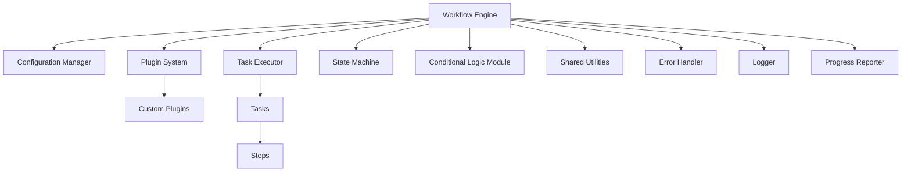

# Task Automation Orchestrator (TAO) v2.0

## Table of Contents
- [Overview](#overview)
- [Key Features](#key-features)
- [Quick Start Guide](#quick-start-guide)
- [Configuration Structure](#configuration-structure)
- [System Architecture](#system-architecture)
- [Installation and Setup](#installation-and-setup)
- [Creating and Using Plugins](#creating-and-using-plugins)
- [Creating Workflows](#creating-workflows)
- [Advanced Configuration Examples](#advanced-configuration-examples)
- [Performance Considerations](#performance-considerations)
- [Testing and Debugging](#testing-and-debugging)
- [Error Handling and Logging](#error-handling-and-logging)
- [Security Best Practices](#security-best-practices)
- [Contributing](#contributing)
- [License](#license)
- [Troubleshooting](#troubleshooting)
- [FAQ](#faq)
- [Changelog](#changelog)
- [Roadmap](#roadmap)

## Overview

The Task Automation Orchestrator (TAO) v2.0 is a powerful, flexible system designed to automate complex, multi-step workflows. This refactored version builds upon the original AI-driven design, transitioning to a more traditional, logic-based approach using Python. TAO v2.0 offers enhanced configurability, improved error handling, and a plugin-based architecture for maximum flexibility.

## Key Features

- **Dual Configuration Modes**: Choose between complex and basic configuration setups to suit your workflow needs.
- **Plugin-based Architecture**: Easily extend functionality with custom plugins.
- **Advanced Conditional Logic**: Create sophisticated workflows with complex branching and decision-making.
- **Dynamic Data Flow**: Flexibly pass data between tasks and steps within your workflow.
- **Comprehensive Error Handling**: Robust error management at multiple levels (workflow, task, and step).
- **Detailed Logging**: Configure logging at global and task-specific levels.
- **Templating System**: Reuse common configurations across different workflows.
- **Resource Management**: Easily manage external resources like databases and API endpoints.
- **Security Features**: Built-in security configurations for sensitive operations.

## Quick Start Guide

1. Clone the repository:
   ```
   git clone https://github.com/jimmc414/TAOv2.git
   cd tao-agentTAOv2
   ```

2. Install dependencies:
   ```
   pip install -r requirements.txt
   ```

3. Create a basic configuration file `my_config.yaml`:
   ```yaml
   config_version: "2.2"
   name: "My First TAO Workflow"
   
   workflow:
     name: "Hello World Workflow"
     tasks:
       - name: say_hello
         plugin: core_plugin
         function: print_message
         parameters:
           message: "Hello, TAO!"
   ```

4. Run TAO:
   ```
   python TAOv2.py --config my_config.yaml
   ```

## Configuration Structure

TAO v2.0 supports two levels of configuration complexity:

1. **Complex Configuration** (`complex_config.yaml`):
   - Modular structure with references to other configuration files
   - Schema definitions for validation
   - Detailed task and step configurations
   - Advanced conditional logic and data flow management
   - Task-specific logging configurations

2. **Basic Configuration** (`basic_config.yaml`):
   - Essential configuration elements
   - Simplified workflow structure
   - Minimal plugin usage
   - Basic error handling and logging

## System Architecture

TAO v2.0 is built on a modular architecture with the following key components:



1. **Workflow Engine**: Manages the overall process flow and plugin execution.
2. **Configuration Manager**: Handles loading and parsing of YAML configuration files.
3. **Plugin System**: Allows for easy integration of custom task sets and workflows.
4. **Task Executor**: Responsible for executing individual tasks and managing their lifecycle.
5. **State Machine**: Maintains and manages the state of the workflow execution.
6. **Conditional Logic Module**: Implements rule-based decision making for dynamic workflow control.
7. **Shared Utilities**: Common functions available to all tasks and plugins.
8. **Error Handler**: Manages error detection, reporting, and recovery strategies.
9. **Logger**: Records system events, task executions, and error information.
10. **Progress Reporter**: Tracks and reports the progress of tasks and overall workflow.

## Installation and Setup

1. Clone the repository:
   ```
   git clone https://github.com/jimmc414/TAOv2.git
   cd TAOv2
   ```

2. Install dependencies:
   ```
   pip install -r requirements.txt
   ```

3. Configure your environment:
   - Copy `example.env` to `.env` and fill in the necessary environment variables.
   - Choose between `complex_config.yaml` or `basic_config.yaml` as your starting point.

4. Run TAO:
   ```
   python TAOv2.py --config your_config.yaml
   ```

## Creating and Using Plugins

Plugins are the core of TAO's extensibility. To create a new plugin:

1. Create a new Python file in the `plugins` directory (e.g., `my_plugin.py`).
2. Implement the required plugin interface:

   ```python
   from tao.base_plugin import BasePlugin

   class MyPlugin(BasePlugin):
       def initialize(self):
           # Plugin initialization code

       def execute_task(self, task_name: str, parameters: dict):
           # Task execution code

       def cleanup(self):
           # Cleanup code
   ```

3. Register your plugin in the configuration file:

   ```yaml
   plugins:
     - name: "my_plugin"
       module: "plugins.my_plugin"
       description: "Description of my plugin"
   ```

## Creating Workflows

Workflows are defined in the YAML configuration file. Here's a basic example:

```yaml
workflow:
  name: "My Workflow"
  description: "A simple workflow example"
  tasks:
    - name: task1
      plugin: my_plugin
      function: do_something
      parameters:
        param1: value1
    - name: task2
      plugin: another_plugin
      function: do_something_else
      parameters:
        param2: value2
```

For more complex workflows, refer to the `complex_config.yaml` example.

## Advanced Configuration Examples

Here's an example of a more complex workflow with conditional branching:

```yaml
workflow:
  name: "Advanced Data Processing"
  tasks:
    - name: fetch_data
      plugin: data_plugin
      function: fetch_from_api
      parameters:
        api_endpoint: "https://api.example.com/data"
    - name: process_data
      plugin: data_plugin
      function: process_json
      parameters:
        input: "{{ tasks.fetch_data.output }}"
    - name: conditional_task
      plugin: core_plugin
      function: branch
      conditions:
        - condition: "{{ tasks.process_data.output.count > 100 }}"
          true_branch: large_dataset_handler
          false_branch: small_dataset_handler
    - name: large_dataset_handler
      plugin: data_plugin
      function: handle_large_dataset
    - name: small_dataset_handler
      plugin: data_plugin
      function: handle_small_dataset
```

## Performance Considerations

To optimize the performance of your TAO workflows:

1. Use the `parallel` option for tasks that can run concurrently.
2. Implement caching mechanisms in your plugins for frequently accessed data.
3. Use generator functions for processing large datasets to minimize memory usage.
4. Profile your workflows using the built-in profiling tool:
   ```
   python tao_agent.py --config your_config.yaml --profile
   ```

## Testing and Debugging

TAO v2.0 includes a comprehensive testing framework:

1. Unit tests for individual plugins and tasks:
   ```
   python -m unittest discover tests/unit
   ```

2. Integration tests for entire workflows:
   ```
   python -m unittest discover tests/integration
   ```

3. Debug mode for detailed logging:
   ```
   python tao_agent.py --config your_config.yaml --debug
   ```

## Error Handling and Logging

TAO v2.0 provides comprehensive error handling and logging:

- Configure global and task-specific logging in the YAML configuration.
- Use the `error_handling` section in the configuration to define retry logic and fallback actions.
- Implement custom error handling in your plugins by overriding the `handle_error` method.

Example configuration:

```yaml
logging:
  global:
    level: INFO
    file: "./logs/tao_log.txt"
  tasks:
    data_processing:
      level: DEBUG

error_handling:
  global:
    max_retries: 3
    retry_delay: 60
  tasks:
    api_call:
      max_retries: 5
      retry_delay: 30
```

## Security Best Practices

1. Use environment variables for sensitive information (API keys, passwords).
2. Implement proper authentication and authorization in your plugins.
3. Regularly update TAO and its dependencies.
4. Use HTTPS for any network communications.
5. Implement input validation for all user-supplied data.
6. Regularly audit your workflows and plugins for security vulnerabilities.

## Contributing

We welcome contributions to TAO! Please read our [CONTRIBUTING.md](CONTRIBUTING.md) for details on our code of conduct and the process for submitting pull requests.

## License

This project is licensed under the MIT License - see the [LICENSE](LICENSE) file for details.

## Troubleshooting

Common issues and their solutions:

1. **Plugin not loading**: Ensure the plugin is in the correct directory and properly registered in the configuration file.
2. **Configuration validation errors**: Check your YAML syntax and ensure all required fields are present.
3. **Task execution failures**: Review the logs for specific error messages and ensure all required resources are available.

## FAQ

Q: Can I mix complex and basic configurations?
A: Yes, you can start with a basic configuration and gradually add complex features as needed.

Q: How do I add a new task type?
A: Create a new plugin that implements the task logic, then reference it in your workflow configuration.

Q: Is TAO suitable for distributed workflows?
A: Currently, TAO is designed for local execution. Distributed workflow support is on our roadmap for future versions.

## Changelog

### v2.0.0 (Current)
- Refactored to plugin-based architecture
- Introduced dual configuration modes (complex and basic)
- Improved error handling and logging
- Added advanced conditional logic and data flow management

### v1.5.0
- Added initial plugin support
- Improved workflow visualization

### v1.0.0
- Initial release with AI-driven workflow management

## Roadmap

- [ ] Distributed workflow execution support
- [ ] GUI for workflow design and monitoring
- [ ] Machine learning integration for workflow optimization
- [ ] Real-time collaboration features
- [ ] Extended API for third-party integrations
