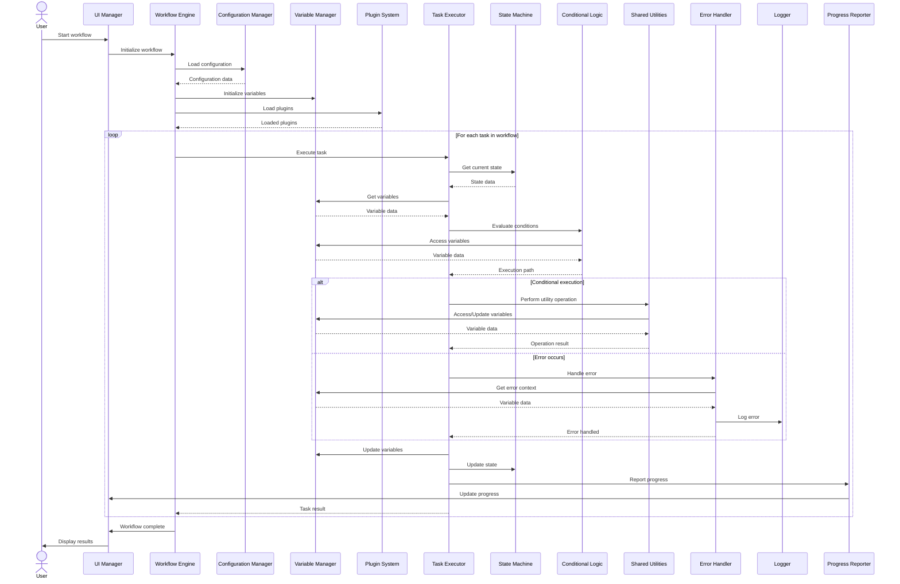

# TAO Agent v2.0 Sequence Diagram

## Overview

This document presents the revised Sequence Diagram for the Task Automation Orchestrator (TAO) Agent v2.0, incorporating enhanced variable management and conditional logic capabilities. The diagram illustrates the interactions between different components of the system over time, showing the flow of control and data during a typical workflow execution, with a focus on variable handling and advanced conditional logic.

## Diagrams
```
User        UI Manager    Workflow Engine  Config Manager  Variable Manager Plugin System   Task Executor   State Machine   Conditional Logic Shared Utilities Error Handler   Logger    Progress Reporter
 |               |                |                |                |               |                |                |                   |                  |               |          |                  |
 | Start workflow|                |                |                |               |                |                |                   |                  |               |          |                  |
 |-------------->|                |                |                |               |                |                |                   |                  |               |          |                  |
 |               | Initialize     |                |                |               |                |                |                   |                  |               |          |                  |
 |               | workflow       |                |                |               |                |                |                   |                  |               |          |                  |
 |               |--------------->|                |                |               |                |                |                   |                  |               |          |                  |
 |               |                | Load config    |                |               |                |                |                   |                  |               |          |                  |
 |               |                |--------------->|                |               |                |                |                   |                  |               |          |                  |
 |               |                |<---------------|                |               |                |                |                   |                  |               |          |                  |
 |               |                | Initialize     |                |               |                |                |                   |                  |               |          |                  |
 |               |                | variables      |                |               |                |                |                   |                  |               |          |                  |
 |               |                |-------------------------------->|               |                |                |                   |                  |               |          |                  |
 |               |                |                |                |               |                |                |                   |                  |               |          |                  |
 |               |                | Load plugins   |                |               |                |                |                   |                  |               |          |                  |
 |               |                |------------------------------------------------>|                |                |                   |                  |               |          |                  |
 |               |                |<------------------------------------------------|                |                |                   |                  |               |          |                  |
 |               |                |                |                |               |                |                |                   |                  |               |          |                  |
 |               |                |----------------- For each task in workflow -----|                |                |                   |                  |               |          |                  |
 |               |                | Execute task   |                |               |                |                |                   |                  |               |          |                  |
 |               |                |------------------------------------------------>|                |                |                   |                  |               |          |                  |
 |               |                |                |                |               | Get current    |                |                   |                  |               |          |                  |
 |               |                |                |                |               | state          |                |                   |                  |               |          |                  |
 |               |                |                |                |               |--------------->|                |                   |                  |               |          |                  |
 |               |                |                |                |               |<---------------|                |                   |                  |               |          |                  |
 |               |                |                |                |               | Get variables  |                |                   |                  |               |          |                  |
 |               |                |                |                |               |--------------->|                |                   |                  |               |          |                  |
 |               |                |                |                |               |<---------------|                |                   |                  |               |          |                  |
 |               |                |                |                |               | Evaluate       |                |                   |                  |               |          |                  |
 |               |                |                |                |               | conditions     |                |                   |                  |               |          |                  |
 |               |                |                |                |               |-------------------------------->|                   |                  |               |          |                  |
 |               |                |                |                |               |<--------------------------------|                   |                  |               |          |                  |
 |               |                |                |                |               |                |                |                   |                  |               |          |                  |
 |               |                |                |                |               |---- Conditional execution ------|                   |                  |               |          |                  |
 |               |                |                |                |               | Perform utility|                |                   |                  |               |          |                  |
 |               |                |                |                |               | operation      |                |                   |                  |               |          |                  |
 |               |                |                |                |               |---------------------------------------------------->|                  |               |          |                  |
 |               |                |                |                |               |<----------------------------------------------------|                  |               |          |                  |
 |               |                |                |                |               |                |                |                   |                  |               |          |                  |
 |               |                |                |                |               | Update         |                |                   |                  |               |          |                  |
 |               |                |                |                |               | variables      |                |                   |                  |               |          |                  |
 |               |                |                |                |               |--------------->|                |                   |                  |               |          |                  |
 |               |                |                |                |               |                |                |                   |                  |               |          |                  |
 |               |                |                |                |               |---- Error occurs ----------------------------------------------------->|               |          |                  |
 |               |                |                |                |               |                |                |                   |                  | Log error     |          |                  |
 |               |                |                |                |               |                |                |                   |                  |-------------->|          |                  |
 |               |                |                |                |               |                |                |                   |                  |<--------------|          |                  |
 |               |                |                |                |               |                |                |                   |                  |               |          |                  |
 |               |                |                |                |               | Update state   |                |                   |                  |               |          |                  |
 |               |                |                |                |               |--------------->|                |                   |                  |               |          |                  |
 |               |                |                |                |               | Report progress|                |                   |                  |               |          |                  |
 |               |                |                |                |               |--------------------------------------------------------------------------------------->|          |                  |
 |               |                |                |                |               |                |                |                   |                  |               |          | Update progress  |
 |               |<---------------------------------------------------------------------------------------------------|                   |                  |               |          |                  |
 |               |                |                |                |               | Task result    |                |                   |                  |               |          |                  |
 |               |                |<------------------------------------------------|                |                |                   |                  |               |          |                  |
 |               |                |                |                |               |                |                |                   |                  |               |          |                  |
 |               |                |--------------- End of loop -----|               |                |                |                   |                  |               |          |                  |
 |               |                |                |                |               |                |                |                   |                  |               |          |                  |
 |               | Workflow       |                |                |               |                |                |                   |                  |               |          |                  |
 |               | complete       |                |                |               |                |                |                   |                  |               |          |                  |
 |               |<---------------|                |                |               |                |                |                   |                  |               |          |                  |
 | Display       |                |                |                |               |                |                |                   |                  |               |          |                  |
 | results       |                |                |                |               |                |                |                   |                  |               |          |                  |
 |<--------------|                |                |                |               |                |                |                   |                  |               |          |                  |
 |               |                |                |                |               |                |                |                   |                  |               |          |                  |
```



## Sequence Description

1. **Workflow Initiation**
   - User starts the workflow through the UI Manager.
   - UI Manager initializes the workflow in the Workflow Engine.

2. **System Preparation**
   - Workflow Engine loads configuration data from the Configuration Manager.
   - Workflow Engine initializes variables through the Variable Manager based on config.
   - Workflow Engine loads necessary plugins through the Plugin System.

3. **Task Execution Loop**
   For each task in the workflow:
   - Workflow Engine instructs the Task Executor to run the task.
   - Task Executor retrieves the current state from the State Machine.
   - Task Executor gets relevant variables from the Variable Manager.
   - Task Executor evaluates conditions using the Conditional Logic module, which can access variables.

4. **Conditional Execution**
   Depending on the evaluation results:
   - Task Executor may perform utility operations using Shared Utilities.
   - Shared Utilities can access and update variables through the Variable Manager.
   - If an error occurs, it's handled by the Error Handler, which can access variables for context, and logged.

5. **Variable and State Updates**
   - Task Executor updates variables in the Variable Manager based on task execution.
   - Task Executor updates the state in the State Machine.

6. **Progress Reporting**
   - Progress, including variable states, is reported to the Progress Reporter, which updates the UI.

7. **Task Completion**
   - Task Executor returns the task result to the Workflow Engine.

8. **Workflow Completion**
   - After all tasks are executed, Workflow Engine notifies UI Manager.
   - UI Manager displays the results, potentially including final variable states, to the User.

## Key Interactions

1. **User-System Interaction**: Primarily through the UI Manager at the start and end of the workflow.
2. **Configuration and Variable Initialization**: Handled by the Workflow Engine and Variable Manager at the beginning of execution.
3. **Plugin Loading**: Managed by the Workflow Engine through the Plugin System.
4. **Variable Management**: Constant interaction between Task Executor, Conditional Logic, Shared Utilities, and Variable Manager throughout execution.
5. **Task Execution Flow**: Coordinated by the Workflow Engine, with actual execution handled by the Task Executor, now including variable resolution and updates.
6. **State Management**: Interaction between Task Executor and State Machine, now potentially including variable states.
7. **Enhanced Conditional Logic**: Used by Task Executor to determine execution paths, now with ability to access and use variable data.
8. **Error Handling**: Errors are managed by the Error Handler, now with access to variable context, and logged appropriately.
9. **Progress Reporting**: Continuous updates from Task Executor through Progress Reporter to UI, potentially including variable state information.

This revised sequence diagram and description provide a more comprehensive view of how the TAO v2.0 system operates, particularly highlighting the new variable management and enhanced conditional logic capabilities. It demonstrates how these features are integrated into the workflow execution process, allowing for more dynamic and flexible automation tasks.