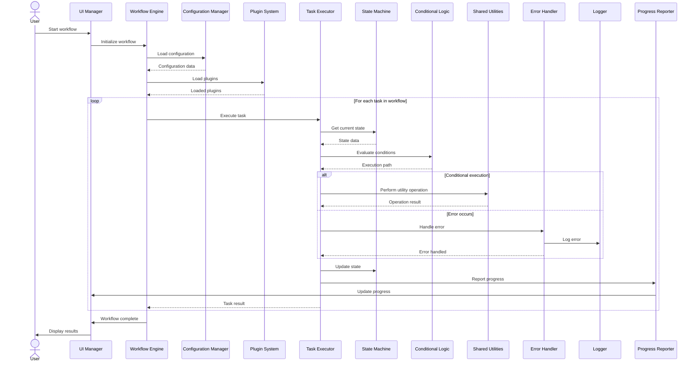

# TAO Agent v2.0 Sequence Diagram

## Overview

This document presents the Sequence Diagram for the Task Automation Orchestrator (TAO) Agent v2.0. The diagram illustrates the interactions between different components of the system over time, showing the flow of control and data during a typical workflow execution.

## Diagrams
```
User        UI Manager    Workflow Engine  Config Manager  Plugin System   Task Executor   State Machine   Conditional Logic Shared Utilities Error Handler   Logger    Progress Reporter
 |               |                |                |               |                |                |                   |                  |               |          |                  |
 | Start workflow|                |                |               |                |                |                   |                  |               |          |                  |
 |-------------->|                |                |               |                |                |                   |                  |               |          |                  |
 |               | Initialize     |                |               |                |                |                   |                  |               |          |                  |
 |               | workflow       |                |               |                |                |                   |                  |               |          |                  |
 |               |--------------->|                |               |                |                |                   |                  |               |          |                  |
 |               |                | Load config    |               |                |                |                   |                  |               |          |                  |
 |               |                |--------------->|               |                |                |                   |                  |               |          |                  |
 |               |                |<---------------|               |                |                |                   |                  |               |          |                  |
 |               |                | Load plugins   |               |                |                |                   |                  |               |          |                  |
 |               |                |------------------------------->|                |                |                   |                  |               |          |                  |
 |               |                |<-------------------------------|                |                |                   |                  |               |          |                  |
 |               |                |                |               |                |                |                   |                  |               |          |                  |
 |               |                |----------------- For each task in workflow -----|                |                   |                  |               |          |                  |
 |               |                | Execute task   |               |                |                |                   |                  |               |          |                  |
 |               |                |------------------------------->|                |                |                   |                  |               |          |                  |
 |               |                |                |               | Get current    |                |                   |                  |               |          |                  |
 |               |                |                |               | state          |                |                   |                  |               |          |                  |
 |               |                |                |               |--------------->|                |                   |                  |               |          |                  |
 |               |                |                |               |<---------------|                |                   |                  |               |          |                  |
 |               |                |                |               | Evaluate       |                |                   |                  |               |          |                  |
 |               |                |                |               | conditions     |                |                   |                  |               |          |                  |
 |               |                |                |               |-------------------------------->|                   |                  |               |          |                  |
 |               |                |                |               |<--------------------------------|                   |                  |               |          |                  |
 |               |                |                |               |                |                |                   |                  |               |          |                  |
 |               |                |                |               |---- Conditional execution ------|                   |                  |               |          |                  |
 |               |                |                |               | Perform utility|                |                   |                  |               |          |                  |
 |               |                |                |               | operation      |                |                   |                  |               |          |                  |
 |               |                |                |               |---------------------------------------------------->|                  |               |          |                  |
 |               |                |                |               |<----------------------------------------------------|                  |               |          |                  |
 |               |                |                |               |                |                |                   |                  |               |          |                  |
 |               |                |                |               |---- Error occurs ----------------------------------------------------->|               |          |                  |
 |               |                |                |               |                |                |                   |                  | Log error     |          |                  |
 |               |                |                |               |                |                |                   |                  |-------------->|          |                  |
 |               |                |                |               |                |                |                   |                  |<--------------|          |                  |
 |               |                |                |               |                |                |                   |                  |               |          |                  |
 |               |                |                |               | Update state   |                |                   |                  |               |          |                  |
 |               |                |                |               |--------------->|                |                   |                  |               |          |                  |
 |               |                |                |               | Report progress|                |                   |                  |               |          |                  |
 |               |                |                |               |--------------------------------------------------------------------------------------->|          |                  |
 |               |                |                |               |                |                |                   |                  |               |          | Update progress  |
 |               |<------------------------------------------------------------------------------------------------------|                  |               |          |                  |
 |               |                |                |               | Task result    |                |                   |                  |               |          |                  |
 |               |                |<-------------------------------|                |                |                   |                  |               |          |                  |
 |               |                |                |               |                |                |                   |                  |               |          |                  |
 |               |                |--------------- End of loop ----|                |                |                   |                  |               |          |                  |
 |               |                |                |               |                |                |                   |                  |               |          |                  |
 |               | Workflow       |                |               |                |                |                   |                  |               |          |                  |
 |               | complete       |                |               |                |                |                   |                  |               |          |                  |
 |               |<---------------|                |               |                |                |                   |                  |               |          |                  |
 | Display       |                |                |               |                |                |                   |                  |               |          |                  |
 | results       |                |                |               |                |                |                   |                  |               |          |                  |
 |<--------------|                |                |               |                |                |                   |                  |               |          |                  |
 |               |                |                |               |                |                |                   |                  |               |          |                  |
 ```



## Sequence Description

1. **Workflow Initiation**
   - User starts the workflow through the UI Manager.
   - UI Manager initializes the workflow in the Workflow Engine.

2. **System Preparation**
   - Workflow Engine loads configuration data from the Configuration Manager.
   - Workflow Engine loads necessary plugins through the Plugin System.

3. **Task Execution Loop**
   For each task in the workflow:
   - Workflow Engine instructs the Task Executor to run the task.
   - Task Executor retrieves the current state from the State Machine.
   - Task Executor evaluates conditions using the Conditional Logic module.

4. **Conditional Execution**
   Depending on the evaluation results:
   - Task Executor may perform utility operations using Shared Utilities.
   - If an error occurs, it's handled by the Error Handler and logged.

5. **State and Progress Updates**
   - Task Executor updates the state in the State Machine.
   - Progress is reported to the Progress Reporter, which updates the UI.

6. **Task Completion**
   - Task Executor returns the task result to the Workflow Engine.

7. **Workflow Completion**
   - After all tasks are executed, Workflow Engine notifies UI Manager.
   - UI Manager displays the results to the User.

## Key Interactions

1. **User-System Interaction**: Primarily through the UI Manager at the start and end of the workflow.
2. **Configuration and Plugin Loading**: Handled by the Workflow Engine at the beginning of execution.
3. **Task Execution Flow**: Coordinated by the Workflow Engine, with actual execution handled by the Task Executor.
4. **State Management**: Constant interaction between Task Executor and State Machine.
5. **Conditional Logic**: Used by Task Executor to determine execution paths.
6. **Error Handling**: Errors are managed by the Error Handler and logged appropriately.
7. **Progress Reporting**: Continuous updates from Task Executor through Progress Reporter to UI.